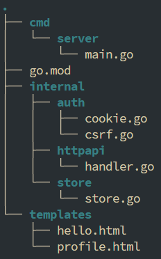
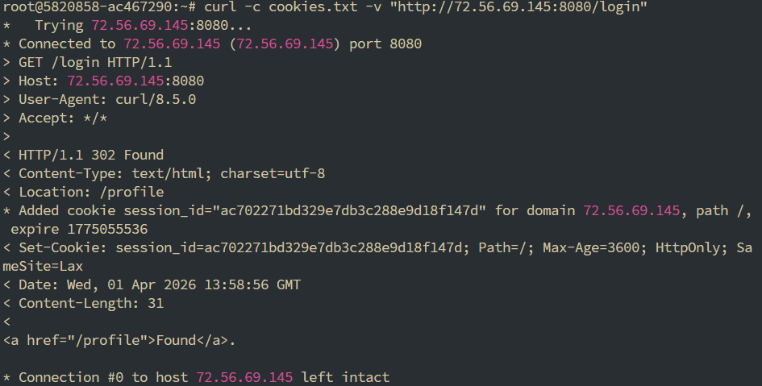
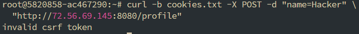
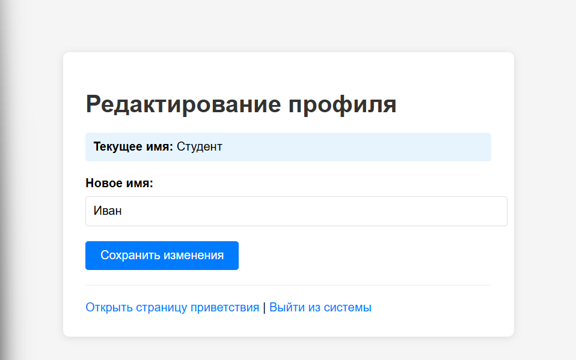
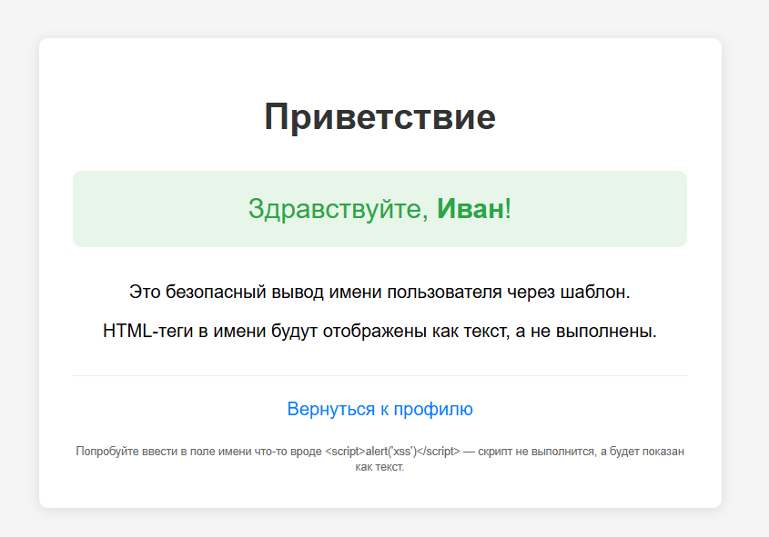
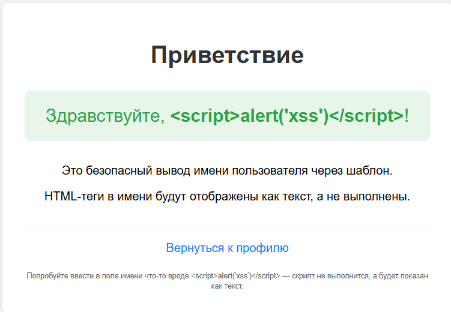

# Практическое занятие №6: Реализация защиты от CSRF/XSS. Работа с secure cookies

### Выполнил: Студент ЭФМО-02-25 Пягай Даниил Игоревич

---

## 1. Цель работы

Освоить базовые практические подходы к защите web-приложения на Go от CSRF- и XSS-угроз, а также научиться безопасно использовать cookies для аутентификации и хранения пользовательского состояния.

---

## 2. Структура проекта



---

## 3. Установка cookie сессии с защитными атрибутами



---

## 4. Демонстрация CSRF-защиты

### 4.1. Попытка поддельного запроса без CSRF-токена



### 4.2. Успешное изменение имени (через браузер с формой)



- Текущее имя: «Студент»
- В поле «Новое имя» введено «Иван»

После отправки формы (токен передаётся автоматически в скрытом поле) сервер обновляет имя.

---

## 5. Страница приветствия после успешного изменения




---

## 6. Демонстрация защиты от XSS

При попытке ввести в поле имени вредоносный скрипт:
```
<script>alert('xss')</script>
```


Страница приветствия отображает его как обычный текст, а не выполняет:



Это достигается за счёт автоматического экранирования HTML-сущностей в шаблонах (`.Name` выводится безопасно).

---

## 7. Используемые технологии и механизмы защиты

| Защита | Реализация |
|--------|-------------|
| **CSRF** | Генерация уникального токена при входе, проверка токена при POST-запросах |
| **XSS** | Автоматическое экранирование в шаблонах, запрет ручной конкатенации HTML |
| **HttpOnly cookie** | Запрет доступа к cookie из JavaScript |
| **SameSite cookie** | Ограничение отправки cookie в межсайтовых сценариях (Lax) |

---

## 8. Контрольные вопросы (ответы)

1. **Что такое CSRF?**  
   Атака, при которой злоумышленник заставляет браузер пользователя отправить запрос на целевой сайт без его ведома, используя автоматическую отправку cookie.

2. **Почему наличие cookie не гарантирует намерение пользователя?**  
   Браузер автоматически прикладывает cookie к любому запросу к домену, даже если инициатор — сторонний сайт.

3. **Что такое XSS?**  
   Внедрение вредоносного JavaScript-кода в страницу, которая затем выполняется в браузере жертвы.

4. **Чем CSRF отличается от XSS?**  
   CSRF атакует доверие сервера к браузеру (подделка запроса), XSS — доверие браузера к данным (внедрение кода).

5. **Зачем нужен CSRF-токен?**  
   Чтобы подтвердить, что запрос исходит именно с оригинального сайта, а не от злоумышленника.

6. **Что делает атрибут HttpOnly?**  
   Запрещает доступ к cookie из JavaScript, снижая риск кражи токена через XSS.

7. **Зачем нужен атрибут Secure?**  
   Требует передачи cookie только по HTTPS (в работе не включён, так как сервер работает по HTTP).

8. **Какую роль играет SameSite?**  
   Ограничивает отправку cookie в межсайтовых запросах (Lax — разрешена навигация верхнего уровня, запрещена отправка в фоновых запросах).

9. **Почему нельзя вставлять пользовательский ввод в HTML через конкатенацию строк?**  
   Пользователь может вставить HTML-теги или скрипты, которые браузер выполнит как код (XSS).

10. **Почему шаблоны безопаснее ручной сборки HTML?**  
    Они автоматически экранируют специальные символы, превращая их в безвредные HTML-сущности.

---

## 9. Выводы

В ходе практической работы:

1. Реализовано web-приложение с имитацией авторизации через сессионную cookie.
2. Cookie настроена с атрибутами **HttpOnly** и **SameSite=Lax**.
3. Внедрена CSRF-защита: генерация и проверка токена в формах.
4. Продемонстрирована невосприимчивость к XSS-атакам благодаря безопасным шаблонам.
5. Проверена работа всех эндпоинтов через браузер и `curl`.

